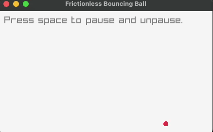

# Frictionless Bouncing Ball

This is a simple implementation of a single bouncing ball in raylib with c++. It can run locally or on [your browser](https://bi3mer.github.io/raylib_tests/000_frictionless_bouncing_ball/). You can press `space` to pause.

## Sources

- [YouTube: 01 - Writing a physics simulation in 10 minutes](https://www.youtube.com/watch?v=oPuSvdBGrpE&feature=youtu.be)
- [Bouncing balls examples](https://github.com/raysan5/raylib/blob/master/examples/shapes/shapes_bouncing_ball.c)
- [Native code in the browser with Emscripten](https://gioarc.me/posts/games/wasm.html)