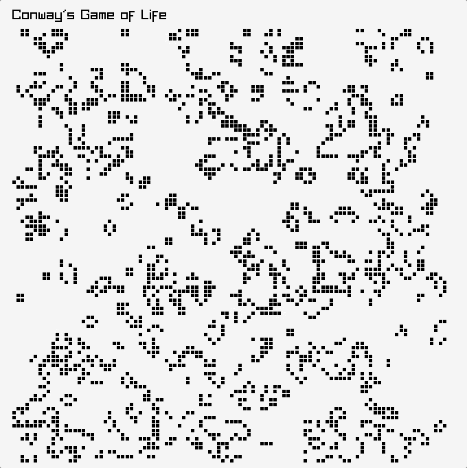

# Frictionless Bouncing Ball

<center>



</center>

This is a simple implementation of a single bouncing ball in raylib with c++. It can run locally or on [your browser](https://bi3mer.github.io/raylib_tests/000_frictionless_bouncing_ball/). You can press `space` to pause.

## Running

I've tested this for simulation with c++17. It may work on earlier versions or later versions, but I haven't tested so I can't guarantee anything. Once you have c++ running, you need [raylib]([raylib](https://www.raylib.com/)) installed. If you want to run the simulation on your browser, you need [emscripten](https://emscripten.org/docs/getting_started/downloads.html) to make a [wasm build](https://webassembly.org/) build. 

### Run Locally

The [makefile](./makefile) uses clang. If you are not on mac or do not have clang, you'll need to change the makefile to use your c++ compiler instead of clang. Then you can run the command below and the simulation will be compiled and then you can watch it run until you get bored.

```bash
make run
```

### Run on the Browser

I have a release build of raylib in the same directory that this repo is in. So `../..`. You can download it with the command below. If you choose to have the raylib folder in this directory, then you'll need to update the [makefile](./makefile) paths for the wasm command.

```bash
curl -sL \
    https://github.com/raysan5/raylib/releases/download/5.0/raylib-5.0_webassembly.zip \
    | bsdtar -x -C .
```

Then you can build with [emscripten](https://emscripten.org/).

```bash
make wasm
```

To see it run locally on your browser, you need a web server running. I use python, but you can use whatever you want.

```bash
python -m http.server 8000
```

Now open your browser and set the url to `127.0.0.1:8000`, and you should see a bouncing ball.

## Sources

- [Conway's game of life](https://en.wikipedia.org/wiki/Conway%27s_Game_of_Life)